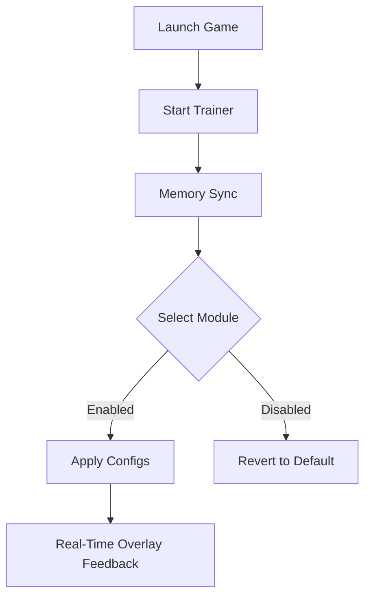

# Hollow Knight: Silksong Trainer – Advanced Gameplay Enhancer for PC 🌀

The **Hollow Knight: Silksong Trainer** is a precision-built enhancement software designed for players who want absolute mastery over Hornet’s journey. From speed tweaks to combat modifiers, it lets you fine-tune every gameplay aspect for deeper immersion and better control. Whether you’re exploring Pharloom or facing ruthless bosses, this trainer provides pro-level assistance without compromising game feel.

---

## ⚙️ Overview

Built for **Windows PC**, this tool provides full support for *Hollow Knight: Silksong* through a smart overlay interface. It connects directly with in-game memory to adjust core parameters dynamically — no file corruption or save risk.

> [!IMPORTANT]
> Always launch the trainer **after** the game has fully loaded to ensure all values are properly mapped.


---

## 🧭 Key Features

* **Health & Soul Locks:** Stay focused on exploration and skill without worrying about constant healing.
* **Movement Control:** Adjust dash cooldowns, double jump height, and climb speeds dynamically.
* **Precision Combat:** Enable *instant parry* or *hit-slow* modes for advanced reaction handling.
* **Geo Magnet:** Automatically attract Geo drops — perfect for farming without interruption.
* **Custom Keybinds:** Configure toggles like `F1` for God Mode or `F3` for Infinite Soul.
* **Boss Mode Balancer:** Create personalized challenge presets that rebalance boss HP and aggression for practice.
* **Overlay UI:** Lightweight performance with less than 1% CPU impact.

---

## 💻 Compatibility

| Platform           | Version          | Status          |
| ------------------ | ---------------- | --------------- |
| Windows 10 / 11    | x64              | ✅ Full Support  |
| Steam / GOG / Epic | All Builds       | ✅ Supported     |
| Controller Mapping | Xbox / DualSense | ⚙️ Configurable |

> [!NOTE]
> Linux users can run the trainer through Proton or Wine, but full overlay compatibility may vary.

---

## ⚡ Setup & Installation

1. **Download** the latest `.zip` build from the verified source.
2. **Extract** to your main game directory or a separate folder.
3. **Run** `SilksongTrainer.exe` as Administrator.
4. **Launch** Hollow Knight: Silksong and wait until the game world loads.
5. Activate desired modules via hotkeys or the on-screen overlay.

Example configuration file:

```ini
[TrainerConfig]
GodMode=True
InfiniteSoul=True
DashCooldown=0.3
DoubleJumpHeight=1.4
GeoAttractRange=50
OverlayOpacity=0.8
```

> [!WARNING]
> Avoid enabling multiple physics-altering options simultaneously — it may desync animations or camera behavior.

---

## 🧩 Functional Flow



---

## 🧠 FAQ

**Q1: Is this safe to use with Steam or Epic versions?**
Yes, the trainer operates in offline memory space and doesn’t interfere with platform data.

**Q2: Can I edit the hotkeys?**
Absolutely. Edit `keybinds.ini` or use the in-app settings to assign any key or controller button.

**Q3: Does it affect achievements?**
No — achievements trigger normally unless the “Practice Mode” flag is toggled on.

**Q4: Will it slow down performance?**
No noticeable FPS drop on modern systems (tested on RTX 3060 and Ryzen 5 series).

**Q5: How often is it updated?**
Updates are released after each official Silksong patch to maintain compatibility.

---

## 🌐 Community & Support

Join our community forums for shared configs, challenge mods, and feature requests.
Participate in early builds and discuss creative ways to reimagine Pharloom’s difficulty curve.

---

### Final Thoughts

The **Hollow Knight: Silksong Trainer** isn’t about cheating — it’s about *custom playstyles*. Whether you want to focus on lore exploration or refine your boss-fighting instincts, this trainer delivers flexibility and control with minimal setup.
